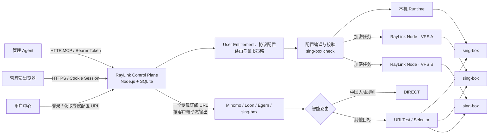
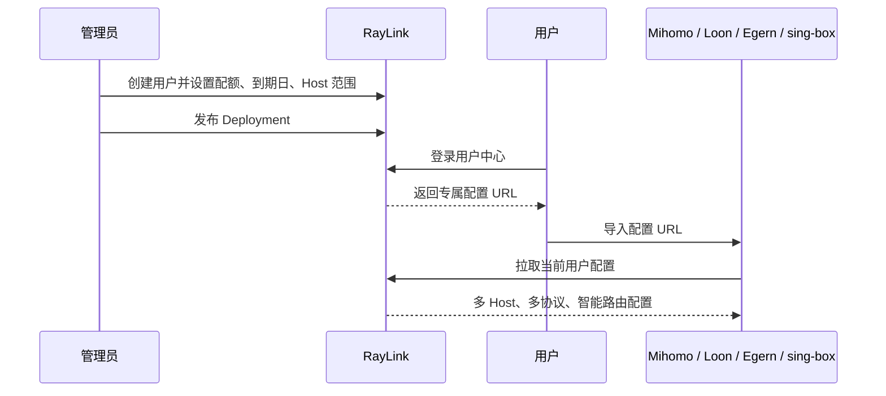

<div align="center">
  
  <h1>RayLink</h1>
  <p><strong>把多用户、多 Host sing-box 服务变成一套可安装、可配置、可发布、可计量的控制面。</strong></p>
  <p>
    <a href="https://github.com/ChengzeXiao/RayLink/releases"></a>
    
    
    
  </p>
</div>


RayLink 面向自建服务和团队内部网络管理：管理员在 Web 控制台创建用户、设置流量与到期时间、接入 VPS、配置 Host 入口协议并发布；用户登录独立用户中心，通过同一个专属订阅地址导入 Clash/Mihomo、Loon、Egern 或 sing-box。国内目标直连，其他流量进入自动测速与故障切换策略。

> [!IMPORTANT]
> RayLink 是网络基础设施管理软件。请只在你有权管理的服务器和网络中部署，并遵守所在地法律、云服务商条款及目标服务的使用政策。

## 为什么选择 RayLink

| 能力 | RayLink 的处理方式 |
|---|---|
| 一台控制面管理多台 VPS | 本机 Runtime 与远程 RayLink Node 使用同一套 Host、协议和 Deployment 模型 |
| User Entitlement 与客户端配置 | 创建用户时直接设置流量、到期时间和 Host 范围；订阅地址加密保存，可随时查看或显式重新生成 |
| 一个订阅地址支持多个客户端 | 按 User Entitlement 编译全部可用 Host 和协议，并按客户端自动输出 Mihomo YAML、Loon 节点、Egern YAML/Profile 或 sing-box JSON |
| Host 入口协议 | 协议绑定到具体 Host，按需启用；一键启用默认使用 Host 域名证书 TLS，并经过能力、端口与语法校验 |
| 智能路由 | Mihomo、Egern 与 sing-box 配置均包含 CN 直连、境外代理、自动选择和故障回退 |
| 安全发布 | `sing-box check`、原子替换、版本快照、失败恢复和历史回滚 |
| 真实流量计量 | 使用 sing-box 用户级统计，不以 Host 网卡总流量估算用户配额 |
| Host 可观测性 | 汇总 CPU、内存、上下行速率、服务状态、心跳和 Runtime 版本 |
| Agent 管理 | [HTTP MCP Server](docs/mcp-server.md) 提供 53 个管理工具，支持独立令牌、权限限制、审计和写入重试 |
| 自动接入 VPS | [SSH 一键接入](docs/ssh-node-provisioning.md)：填写 IP 和登录凭据，自动安装、注册、配置协议、发布并验证订阅 |
| 在线升级 | 发现已验证的 sing-box 新版本后提示升级，失败自动恢复旧二进制和服务状态 |

## 界面预览

### 用户即 User Entitlement

创建用户时直接设置配额、到期日和 Host 范围；停用、到期或超额后，RayLink 会重新编译并发布撤权 Deployment。


### 协议绑定 Host

每台 Host 独立维护入口协议和 Runtime 状态。新 VPS 可通过 SSH 一键接入，自动安装 RayLink Node、启用无需域名的稳定协议并发布；进度和验证结果保存在主机页。也可通过一次性接入令牌手动安装。


## 架构



核心数据流：

1. 管理员修改 User Entitlement、Host 或协议。
2. 控制面按每台 Host 生成候选配置，并执行版本、构建标签、端口、TLS 和 `sing-box check` 校验。
3. 本机使用原子文件替换；远程 RayLink Node 领取加密任务并在 Host 本地校验、发布和重启。
4. 用户客户端配置按当前 User Entitlement 聚合多个 Host 与协议，自动加入智能路由、测速和故障切换。
5. RayLink Node 回传心跳、Host 资源遥测、Runtime 状态和用户级流量增量。

## 本机持久入口

运行 `npm run local`，访问 `http://127.0.0.1:4199`。该入口使用真实后端和 SQLite，初始不生成模拟用户或 VPS；数据保存在忽略版本控制的 `.raylink-local/`，重启后仍保留。首次随机生成的登录信息见 `.raylink-local/initial-login.txt`（仅当前用户可读）；界面改名或改密后使用新凭据，初始文件不会自动更新。服务端加密密钥保存在同目录的 `local-credentials.json`，备份时保留整个目录。Ctrl-C 停止，重新运行同一命令启动；无需沿用验收时的临时端口。

该模式的本机 Runtime 只校验和暂存配置，不宣称代理已运行。远程 VPS 无法通过你的 `127.0.0.1` 访问控制面；真实 SSH 自动接入必须先部署服务器可访问的 HTTPS 控制面。界面会提前显示此条件并阻止提交 SSH 凭据。服务断开时显示当前地址、过期数据提示和重连入口，读取请求逐步退避；不会自动重放创建用户/节点等写操作。

可通过 `RAYLINK_LOCAL_DATA_DIR` 指定专用的本地数据目录、`RAYLINK_PORT` 指定端口。不要把生产数据库直接交给本地开发进程。

## 一键安装

当前发布安装包面向 **Debian/Ubuntu + systemd + AMD64（x86_64）或 ARM64（aarch64）**。在生产验收清单全部通过前，应视为候选版本。准备一台全新 VPS，并开放：

- Caddy 自动 HTTPS 需要的 `80`
- 控制台 HTTPS 端口 `443`
- 你在界面启用的代理协议端口

服务器需要预先具备 `curl`。使用 root 登录时，直接复制执行这一条命令：

```bash
bash -o pipefail -c 'curl -fsSL https://github.com/ChengzeXiao/RayLink/releases/download/v0.2.47/install.sh | bash'
```

普通用户登录时，把管道中的 `bash` 改为 `sudo bash`：

```bash
bash -o pipefail -c 'curl -fsSL https://github.com/ChengzeXiao/RayLink/releases/download/v0.2.47/install.sh | sudo bash'
```

脚本会检测公网 IP 和 CPU 架构，下载对应的 AMD64 或 ARM64 发布包及 SHA-256，校验后解压，再执行系统安装。
若需要指定公网 IP：

```bash
bash -o pipefail -c 'curl -fsSL https://github.com/ChengzeXiao/RayLink/releases/download/v0.2.47/install.sh | bash -s -- --public-ip 203.0.113.10'
```

一键安装会自动完成：

- 安装并校验 Node.js 22
- 安装预编译的 sing-box 1.14.2 计量版 Runtime
- 配置 RayLink、HTTPS 入口与 systemd 自启动
- 为 IP 首次访问生成本机证书
- 自动创建管理员、启用无需域名证书的 Shadowsocks、发布配置并检查服务与监听端口
- 检测并配置 Linux BBR，显示实际内核状态；不支持时保留明确待处理项
- 将初始登录信息保存到服务器 `/etc/raylink/initial-login.json`（仅 root 可读）

安装完成后直接打开输出的 HTTPS 控制台地址。默认使用 IP；SSH 自动接入会将主控证书经受信任 SSH 通道传到节点并严格校验 HTTPS。浏览器、MCP 和订阅客户端仍需信任该自签名证书。已有域名时，设置 `RAYLINK_DOMAIN` 和 `RAYLINK_ACME_EMAIL`，即可自动检查解析并通过 Caddy 申请、续期公网可信证书。

如需分别配置控制台、订阅和节点域名，可设置 `RAYLINK_INTERACTIVE_SETUP=true` 使用初始化向导。域名须事先解析到对应 VPS，初始化时关闭 CDN 代理。自动化流程、BBR 状态和更新边界见 [自动安装与维护](docs/automatic-installation.md)。以上功能包含在 v0.2.33 中；已有安装需升级后生效。

完整部署、Caddy、手动安装和令牌轮换说明见 [部署手册](deploy/README.md)。

## 添加第二台 VPS

第一台 Host 同时运行控制面和本机 Runtime。新增 Host 不需要再次安装完整控制台：

1. 打开「系统 → 主机 → SSH 一键接入」。
2. 填写 IP、SSH 端口、用户名及密码或私钥。
3. 自动安装依赖、RayLink Node、审批版本 Runtime，并尝试启用 BBR。
4. 自动注册、配置 Shadowsocks、按设置配置节点域名及兼容协议、发布并验证已有用户订阅。
5. 在主机列表和详情查看安装进度、实际 BBR 状态及失败后的续接入口。手动安装命令仍然保留。

接入令牌只能使用一次。RayLink Node 身份、加密私钥和受管配置分别保存在受限目录中；控制面不会以明文任务或日志下发 TLS 私钥。

## 从 User Entitlement 到客户端配置



配置 URL 的密钥按密码处理：服务端只保存 SHA-256 哈希，重置后旧地址立即失效；响应使用私有缓存策略和 ETag。用户停用、到期、超额或 Host 范围变化后，下一次更新会取得新的有效配置。

同一个通用地址会根据客户端 User-Agent 返回对应格式，浏览器打开时显示客户端选择页；
Loon 直接使用不带参数和扩展名的通用地址，由客户端 User-Agent 自动选择原生节点格式。
也可以显式使用 `?format=mihomo`、`?format=loon`、`?format=egern`、
`?format=egern-profile` 或 `?format=singbox`。用户中心和管理员用户详情同时提供订阅
二维码、复制链接、Mihomo 一键导入、Loon 节点订阅、Egern 一键导入及 sing-box JSON
下载。重新生成地址会让所有格式的旧地址一起失效，不需要分别管理多个密钥。

## 协议与路由

RayLink 的协议目录来自安装 Runtime 的 `version + platform + build tags`，不会把“sing-box 源码中存在”误标成“当前 Host 可用”。

| 类型 | 当前界面能力 |
|---|---|
| 公网用户协议 | Shadowsocks 2022、VMess、VLESS、Trojan、Naive、AnyTLS、Hysteria、TUIC、Hysteria 2 |
| 组合与传输 | 证书 TLS、Reality、HTTP、WebSocket、QUIC、gRPC、HTTPUpgrade |
| 私有入口 | SOCKS、HTTP Proxy、Mixed |
| 高级/系统入口 | ShadowTLS、Direct、TUN、Redirect、TProxy |
| 客户端策略 | TUN、DNS 劫持、完整 CN/局域网分流、TCP 默认选择、独立 AI 稳定出口、客户端故障切换和手选 |

完整的 inbound、outbound、endpoint、构建标签与平台限制见 [sing-box 协议支持矩阵](docs/sing-box-protocol-support.md)。

智能分流的 DNS/规则顺序、完整离线数据、更新方式和原生模拟结果见 [智能分流修复与验收](docs/smart-routing-implementation.md)。

## 项目结构

RayLink 的应用文件直接位于仓库根目录：

```text
server/   控制面 API、SQLite、配置编译、节点任务与流量计量
web/      管理控制台、首次初始化、用户中心与 RayLink Node
deploy/   一键安装、升级、systemd、Caddy 与发布包脚本
tests/    API、协议、Deployment、安全、计量与稳定性测试
docs/     架构决策、协议支持矩阵和生产落地资料
```

## 本地开发

要求 Node.js 22.5+。没有 sing-box 也可以使用 `dry-run` 查看和开发控制台；安装 sing-box 后可执行真实配置校验。

```bash
git clone https://github.com/ChengzeXiao/RayLink.git
cd RayLink
npm ci --ignore-scripts
npm start
```

默认访问 [http://127.0.0.1:4173](http://127.0.0.1:4173)，仅限本机开发的初始凭据：

```text
用户名：admin
密码：Admin@2026
```

生产模式会拒绝使用该默认密码。项目不加载 `.env` 文件；需要直接导出环境变量，或由 systemd `EnvironmentFile` 注入：

```bash
RAYLINK_ADMIN_PASSWORD='replace-with-a-long-random-secret' \
RAYLINK_DATA_DIR='/var/lib/raylink' \
RAYLINK_PROXY_HOST='node.example.com' \
RAYLINK_LOCAL_HOST_DIAL_ADDRESS='203.0.113.10' \
RAYLINK_ENDPOINT_DNS_SERVERS='1.1.1.1,8.8.8.8' \
SING_BOX_BIN='/usr/local/bin/raylink-sing-box' \
npm start
```

Host 始终保存并展示 `RAYLINK_PROXY_HOST` 域名。RayLink 会通过可信 DNS 自动解析域名，按 TTL
缓存，通过已启用的 TCP 协议端口检查候选 IP，并把最后一次可用结果持久化到数据目录。
DNS 或健康检查失败时，才使用 `RAYLINK_LOCAL_HOST_DIAL_ADDRESS` 作为最终回退。

无参数订阅会继续按客户端自动适配：FlClash/Mihomo 和 sing-box 保留节点域名并注入精确解析，
Loon/Egern 使用已解析 IP 拨号但保留 TLS SNI 域名，从而避开 Fake-IP 自环。可信 DNS 默认是
`1.1.1.1,8.8.8.8`，可用 `RAYLINK_ENDPOINT_DNS_SERVERS` 调整；TCP 检查超时默认 1500ms，
可用 `RAYLINK_ENDPOINT_PROBE_TIMEOUT_MS` 调整。可信 DNS 查询本身最多等待 2000ms，可用
`RAYLINK_ENDPOINT_DNS_TIMEOUT_MS` 调整，确保更新请求能及时进入持久缓存或公网 IP 回退。

运行自动化生产前检查。`check:production` 需要 PATH 中有带 `with_v2ray_api` 的 sing-box 1.14.2、OpenSSL 与 curl；
它覆盖代码回归、协议语法和短时内存烟测，但不替代干净 VPS、真实客户端、故障注入与
72 小时运行验收：

```bash
npm run check
npm run check:production
```

## 关键配置

| 环境变量 | 默认值 | 用途 |
|---|---:|---|
| `RAYLINK_HOST` | `127.0.0.1` | 控制面监听地址 |
| `RAYLINK_PORT` | `4173` | 控制面端口 |
| `RAYLINK_PUBLIC_ORIGIN` | 按监听地址生成 | 浏览器实际使用的 HTTPS Origin |
| `RAYLINK_TRUST_PROXY` | `false` | 仅在可信反向代理后设为 `true` |
| `RAYLINK_DATA_DIR` | `./data` | SQLite、快照和受管配置目录 |
| `RAYLINK_RUNTIME_MODE` | `dry-run` | `dry-run` 或 `systemd` |
| `RAYLINK_USER_METERING` | `true` | 保留用户级流量统计能力 |
| `RAYLINK_CADDYFILE` | `/etc/caddy/Caddyfile` | 首次初始化受管 Caddy 配置 |
| `RAYLINK_ENV_FILE` | `/etc/raylink/raylink.env` | 域名切换后持久化正式入口 |
| `SING_BOX_BIN` | `sing-box` | 受管 sing-box 可执行文件 |
| `SING_BOX_SYSTEMD_UNIT` | `sing-box.service` | 发布后重启的 systemd 服务 |

生产环境必须让 RayLink 只监听回环地址，并由 Caddy 提供 HTTPS；不要向公网直接开放 `4173`。
`/sub/` URL 包含配置 URL 密钥，RayLink 生成的 Caddyfile 默认不开启访问日志。

## 当前边界

当前代码已覆盖单控制面、多 Host、用户客户端配置、安全发布、真实流量计量，以及由 Caddy 管理的首次初始化与域名配置。以下功能仍在后续范围：

- TLS 证书到期告警与更多 DNS 提供商 API 集成
- 财务账单、退款和财务级人工调账
- 多 Host 灰度升级与维护窗口
- 同一种协议的多个独立 inbound 实例
- 完整 outbound、endpoint、DNS 和路由规则图形化编辑器
- 邮件邀请、忘记密码、2FA 与细粒度 RBAC

## 项目资料

- [本轮系统审查、修复与验证](docs/system-review-2026-10-01.md)
- [运行体检与实用功能设计](docs/practical-features.md)
- [应用源码说明](docs/application.md)
- [生产部署手册](deploy/README.md)
- [sing-box 协议支持矩阵](docs/sing-box-protocol-support.md)
- [生产落地计划](docs/release/raylink-production-implementation-plan.md)
- [v0.2.0 生产候选验收记录](docs/release/v0.2.0-production-acceptance.md)
- [v0.2.1 发布说明](docs/release/v0.2.1.md)
- [v0.2.13 发布说明](docs/release/v0.2.13.md)
- [v0.2.12 发布说明](docs/release/v0.2.12.md)
- [领域模型](CONTEXT.md)
- [架构决策记录](docs/adr/)
- [v0.2.0 发布说明](docs/release/v0.2.0.md)


### v0.2.47 / Runtime 稳定性、身份计量与安全修复

完成系统审查 R01–R11：收紧 REST/MCP 凭据权限，修复密码重置与并发限流竞态，恢复丢失注册响应；回滚按当前授权重编译，计量绑定不可变用户身份及成功应用的 Host 授权。相同配置在活动文件、Runtime 实例及证书证据匹配时免重启，前端区分操作提交成功与刷新失败；修复 Mihomo HTTPUpgrade 和住宅出口下普通流量 DNS 回退。Node 更新至 0.9.2，保留旧版滚动兼容。

本次有 SQLite 迁移，升级时使用默认完整数据回滚；旧 Runtime 首次建立应用证据可能受控重启并造成短暂重连。本地 797/797 回归和隔离原生验收已通过；正式发布 CI、生产状态与真实手机/住宅代理验收分别确认。使用 HTTPUpgrade 的设备需刷新完整订阅。详见 [发布说明](docs/release/v0.2.47.md) 与 [修复验收记录](docs/system-fixes-2026-10-08.md)。

### v0.2.46 / 国内 CDN 的智能 DNS 选择

Clash/Mihomo 智能完整订阅对未收录域名先取得国内 DNS 候选，仅接受受管中国 IPv4 范围内的 A 记录，否则使用代理 DNS，减少国内 App 图片被分配到海外 CDN 的绕行。保留 AI、明确海外域名及自定义 DNS 优先级。更新完整订阅并重连后生效；其他客户端格式保持原语义。详见 [发布说明](docs/release/v0.2.46.md)。

### v0.2.45 / 国内地理 IP 分流

国内 IP 兜底改用经审核的地理位置数据，修复部分国内云服务器因运营商注册国家不同而误走代理的问题。AI、明确国外域名和自定义规则仍优先，未知流量保留手动兜底组。各设备需刷新完整订阅并重新连接。详见 [发布说明](docs/release/v0.2.45.md)。

### v0.2.44 / 统一客户端分流

服务器统一下发未分类流量手动兜底组、AI 手动固定节点选项和局域网 DNS 排除项。固定主机和用户授权继续约束 AI 候选，Google 香港归入普通代理。完整订阅更新后可移除客户端临时覆写；系统代理和 VPN/TUN 权限仍由客户端控制。详见 [发布说明](docs/release/v0.2.44.md)。

### v0.2.43 / 国内分流与 AI 域名规则一致性

修复牵手等未收录 `.cn` 域名依赖海外 DNS 的问题，将既有国内兜底同步到完整订阅。自定义“AI 出口”域名规则同时用于完整订阅与已启用的住宅 Runtime，普通 Google、YouTube、X、Instagram 和共享服务有独立住宅保护。界面与 MCP 显示内置覆盖、规则版本、具体命中原因及发布状态；住宅未启用不影响默认使用。保存后刷新完整订阅并重连。详见 [发布说明](docs/release/v0.2.43.md)。

### v0.2.42 / AI 出口二选一

「智能路由 → AI 出口与检测 → AI 出口」统一选择 **默认出口** 或 **住宅代理出口**，仅展示所选配置，一次保存并发布。服务器模式保留住宅参数但停止使用；住宅模式支持 SOCKS5、HTTP、HTTPS。界面与 MCP 区分已保存的选择和最近成功发布模式，发布失败可重试；普通 Google 和浏览范围不变。旧接口兼容，详见 [发布说明](docs/release/v0.2.42.md)。

### v0.2.41 / AI 专用上游代理

在「智能路由 → AI 出口与检测 → 固定 AI 上游」配置 SOCKS5、HTTP 或 HTTPS 代理，默认关闭。住宅出口仅处理 AI 专用网站、登录和 API 域名，Google 搜索及普通浏览保留原出口；提供凭据加密、保存发布状态和同配置代理诊断，MCP 支持查询、编辑和重试发布。当前适用于本地主控 `local`，详见 [发布说明](docs/release/v0.2.41.md)。

### v0.2.40 / 固定 AI 出口与分层诊断

智能路由新增 AI 出口主机固定，保留该主机全部授权协议；固定主机不可用时拒绝 AI 流量，避免意外切到其他主机。界面及 MCP 可区分 DNS、TLS、超时、验证页、认证和限流；诊断仅代表主控服务器匿名出站。保存后请刷新**整份订阅并重连**，详见 [发布说明](docs/release/v0.2.40.md)。

### v0.2.39 / AI 全协议恢复与网站覆盖

AI 自动出口现在能在全部 TCP 候选失效后使用健康的 UDP 协议恢复。补齐 Cloudflare 验证子域以及 AI Studio、NotebookLM、Copilot、OpenRouter、Mistral、Cohere 的专用入口；新增 9 协议的严格 TLS WebSocket 长连接门禁。升级后更新**整份订阅**。网站人机验证、地区及账号限制需单独判断，详见 [发布说明](docs/release/v0.2.39.md) 和 [AI 服务覆盖](docs/ai-service-routing.md)。

### v0.2.37 / AI API 连接稳定性

补齐 ChatGPT、Claude 登录与资源依赖的 AI 路由，修复 Clash 精确域名 DNS 策略未被内核识别的问题；修复共享测速格式默认绕过 AI 自动故障回退的问题，并提供独立 AI 手选。新增原生 DNS、路由及流式连接恢复回归。**更新整份订阅，确认「AI 网站代理」选择「AI 稳定出口」或固定节点**。详见 [v0.2.37 发布说明](docs/release/v0.2.37.md)。

### v0.2.36 / 网络稳定性修复

出口默认使用带故障回退的加密 DNS；传统 Clash/Mihomo 各组测速统一为 12 秒，新版 Mihomo 可选共享测速；本机受管 Caddy 证书自动同步、验证与回滚，状态可在系统证书页与 MCP 查看。**升级后更新整份客户端订阅并重连**。详见 [v0.2.36 发布说明](docs/release/v0.2.36.md) 与 [网络体检](docs/network-health-2026-10-02.md)。

### v0.2.35 / TUIC 兼容与自动配置

TUIC 服务端、订阅与探测统一配置 h3 ALPN，修复部分客户端握手超时。**升级后请更新 TUIC 订阅再连接**；发布运行配置可能短暂重连。自动安装处理全部已启用入口协议的防火墙与监听。详见 [v0.2.35 发布说明](docs/release/v0.2.35.md)。

v0.2.34 起，流量额度按北京时间每月 1 日 00:00 重置。仅首次从 v0.2.33 或更早版本升级时归档旧累计并清零；从 v0.2.34 升级本版保留本月用量。界面、用户中心和 MCP 显示周期及历史，详见[月度流量规则](docs/monthly-usage.md)。

当前版本为 v0.2.47；正式发布资产通过 CI 并上传后，可使用上面的 Release 下载命令安装或升级。
服务端允许 1.13 / 1.14 混合节点滚动升级；新导出的 sing-box JSON 需要 **1.14+ 客户端**。
证书、DNS、计量和模拟测试说明见 [升级验收记录](docs/sing-box-1.14.2-upgrade.md)。
