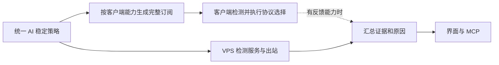

# 单 VPS 的 AI 稳定模式方案

日期：2026-10-04。状态：设计建议，未实现或部署本文件提出的新增自动控制功能。

## 目标与现状

将固定 AI 出口、同机多协议回退、DNS、长连接和故障诊断统一为“AI 稳定模式”。用户只需选择一台主机和稳定优先策略，不必分别协调多处开关。自动操作必须能解释原因，并说明证据来自哪台设备、哪个网络和什么时间。

最近线上核对为 v0.2.39、smart 分流、单 Host、七种协议。当前代码提交 `3420078` 已实现按 Host 固定 AI 出口及匿名分层诊断，尚未上线。精确的连续失败计数、恢复冷却、客户端反馈和自动修复不在该提交中。

单 VPS 上各协议通常使用相同服务器出口；改协议主要解决客户端到 VPS 的传输问题，不等于换 IP，也不能修复整台 VPS 或其公网 IP 不可达。固定 Host 也不保证 NAT / IPv6 等实际出口地址永久不变。

## 一套策略、分别执行

控制面负责策略、域名分类、配置生成、服务器诊断和审计；客户端负责其所在网络的协议选择。手机链路异常不能通过 VPS 自测排除。没有客户端反馈时，页面应明确显示“客户端状态未知”。

“智能”采用可复现的规则和状态转换。Agent 读取证据、解释问题、调用授权管理操作；实时流量选择由本地核心或本地控制器执行，不依赖远端 Agent 在线。

## 统一策略的四项约束

1. **固定主机，协议可回退。** AI 及已收录的登录、API、资源和 WebSocket 依赖域名绑定同一 Host。全协议保留授权和兼容性检查。健康的当前路径优先，延迟仅用于候选排序；初次选择可偏向 TCP，但客户端实测可用的 UDP 仍能恢复 TCP 全故障。所有候选失效时拒绝 AI 代理流量并提示，不自动直连。
2. **DNS 跟随同一策略。** AI 域名使用经固定 Host 的加密 DNS；国内已收录域名及局域网使用独立直连解析；节点自身域名采用不会依赖尚未建立代理的引导解析。未知域名保守使用远程解析，故障时明确报错；若要保留额外国内站点，应通过已知规则或管理员单域名覆盖，不能因远程 DNS 超时就将未知流量全部直连。[Mihomo DNS 官方能力](https://wiki.metacubex.one/en/config/dns/)
3. **保留健康连接。** 协议调整用于后续新连接，避免测速或配置刷新主动关闭正在工作的流式连接。sing-box 的保留设置针对外部入站连接，内部连接仍可能中断，应分别验证。已经断开的 SSE / WebSocket 无法迁移到另一协议并无损续接，由应用恢复；普通加密代理不能自动重放模型请求，以免重复执行或计费。分别管理连接建立、空闲和整体操作期限，不能用统一的短 HTTP 超时截断长回答。
4. **故障分类驱动动作。** 网络连接失败、服务器服务故障、目标网站拒绝和应用认证错误分别处理。匿名探针返回 401 / 403 / 429 不触发切协议；实际用户 HTTPS 内容不会被代理解密，因此应用错误只能来自独立探针或用户明确接入的应用侧反馈。

自定义规则及客户端全局模式可能覆盖上述策略。保存时展示冲突，保留管理员明确设置；页面不得在存在绕过规则时显示“所有 AI 均受保护”。同一第三方共享域名无法总是按网站会话拆分，优先使用精确域名并说明范围。

## 故障决策表

| 证据 | 判断范围 | 自动动作 |
| --- | --- | --- |
| 当前协议客户端检查失败，另一协议在同网络成功 | 当前协议或路径疑似异常 | 对新连接选择同 Host 可用协议；保留其他健康连接 |
| 所有协议从客户端失败，但 VPS 服务和出站正常 | 客户端到 VPS 链路疑似故障 | 显示链路异常，降低重试频率；不判定为 GFW 封锁 |
| VPS 管理服务能访问，代理服务明确停止 | VPS 本机服务故障 | 在预先开启有限自愈后验证配置、尝试一次启动并检查结果；失败停止，不重启整机 |
| 域名解析失败，其他链路证据正常 | DNS 故障 | 只切换同策略允许的 DNS 上游；不改变 AI 出口或关闭证书校验 |
| 验证页、401、403、429、服务端 5xx | 目标服务或应用层状态 | 显示原因与来源，保持协议；应用侧重试需要遵守该服务语义 |
| 缺少或过期的客户端证据 | 原因未知 | 显示未验证并按需检测；不把未知标成正常或封锁 |

服务器自愈必须有冷却和审计；例如十分钟内最多一次启动尝试，第二次故障只告警。只有服务停止、配置有效等明确证据才允许此动作，网页异常或一次超时不足以重启 sing-box。

## 两个可交付层级

### 第一阶段：通用完整订阅，适配现有客户端

- 发布已完成的 Host 固定与诊断功能，提供一键“AI 稳定模式”，统一关联域名、DNS、候选成员和连接保留设置。
- Mihomo 使用按序 fallback；sing-box 使用 URLTest 容差与保留连接设置。两者语义并不相同，界面展示实际能力。[Mihomo fallback](https://wiki.metacubex.one/en/config/proxy-groups/fallback/)、[sing-box URLTest](https://sing-box.sagernet.org/configuration/outbound/urltest/)
- 保持客户端原生健康检测，避免多个重复测速组造成负载；健康目标与 AI 网站状态检测分开。AI 网站验证页不作为协议健康判据。
- 用户需更新完整订阅并重新连接。无回执的客户端只标“配置已生成，客户端应用未确认”，不伪装远程已生效。
- 不承诺精确失败次数、五分钟冷却或跨网络质量学习；这些不能由服务端修改一个订阅字段统一实现。

### 第二阶段：支持本机控制接口的客户端增强

由本地控制器管理 selector，取代 AI 路径上同时运行的自动 fallback / URLTest，避免两个决策者争抢。它通过客户端本机、经过认证的控制接口工作，不能把该接口裸露到公网。默认保留手选，只有明确启用自动管理时接管；控制器退出的降级行为也必须测试。

诊断不得扰乱当前选择。Mihomo 整组测速会清除自动组固定选择，因此使用单代理测试或受控 selector，不把整组测速当作无副作用的状态读取。[Mihomo API](https://wiki.metacubex.one/en/api/)

以下是建议试验值，不是现有实现或所有客户端承诺：

- 当前路径健康时继续使用；延迟短暂升高不切换。
- 当前路径失败后进入复核：二十秒窗口内至少两次失败，且同网络替代路径成功，才切换新连接。若得到明确不可用证据，可加速复核；不能盲等固定长超时。
- 使用两个独立、低流量的固定健康目标交叉验证，避免单个测速站故障淘汰全部协议。
- 切换后设置五分钟回切冷却；新路径若失败仍允许立即复核其他候选。首选恢复不立即抢回，至少三次恢复检查后才重新列为候选，且不因少量延迟优势强行回切。
- Wi-Fi 和蜂窝网络分别保存短期健康状态；切网后旧结果降为未知并重新检测，不上传 SSID 等不必要标识。

普通 iOS 客户端未必开放足够控制能力或后台执行条件，应停留在第一阶段并显示能力限制。严格的失败计数与恢复冷却需要真正控制执行端；`max-failed-times` 不是“连续 N 次健康检查失败后才切换”的通用实现。[Mihomo 分组公共字段](https://wiki.metacubex.one/en/config/proxy-groups/)

## 界面与 MCP 如何统一

建议入口仍在“智能路由”，主界面只保留：AI 稳定模式、固定主机、当前能力级别、最近诊断，以及恢复默认和手动选择。

状态卡应分别展示：服务器运行、服务器出站、客户端链路、目标站点响应。每项带时间和证据来源；没有客户端回报就不显示“当前手机正在使用某协议”。实际出口地址只有在对应路径完成专门测量后才可展示，现有探针的 `remoteAddress` 是目标站点地址。

已有 MCP 的 `routing_get` / `routing_update`、`routing_ai_status` / `routing_ai_check` 继续复用。新增自动管理前增加“预演决策”能力：返回原因、证据新鲜度、影响范围、客户端是否支持和计划动作。真正执行需现有管理权限、幂等请求、配置版本检查、审计与回退；只读 Agent 不能触发切换或服务启动。

## 实现组织

使用一个策略 Module 管理不变量，Interface 接收策略、能力、带来源及有效期的观测、当前状态，返回计划和原因；内部 Implementation 负责分类及状态转换。订阅导出、客户端控制和管理诊断分别作为实际存在的 Adapter，避免把同一决策复制进 UI、MCP 与各配置导出器。

第一阶段只增加编译与诊断协调；没有可用的客户端执行端时，不虚构控制器或显示精确防抖已启用。第二阶段在真实客户端控制 Seam 验证决策和动作回执。

## 验收标准

- 国内直连站点在代理路径断开时仍可解析访问；未知域名和 AI 域名按明确降级策略处理。
- DNS 单上游故障只更换允许的上游；DNS 与业务出口保持一致；节点引导无循环依赖。
- 当前 TCP 路径失败、UDP 存活时可恢复后续请求；全部同机路径失败时不泄漏到 DIRECT。
- 验证页、401 / 403 / 429 和单测速目标失效不产生协议切换或服务重启风暴。
- 对长时间 SSE、WebSocket、超过一分钟空闲、Wi-Fi / 蜂窝切换和真实断流做故障注入；区分健康连接保留与断流后恢复。
- 具备增强能力的客户端验证次数阈值、冷却、手选覆盖、控制器退出、过期证据和多执行者冲突。
- 既有原生核心检查、完整订阅、REST / MCP 权限及 UI 回归保留；每个支持核心按实装版本验收。

建议优先交付第一阶段，并在真实用户客户端上验证。它对当前单 VPS 即有价值；精确自动控制列为独立增强，避免给现有手机订阅作出不能兑现的承诺。
